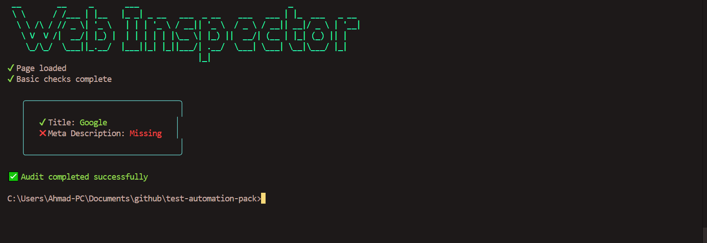

# Playwright JavaScript-Based Test Automation Framework

**Built by Ahmad Faraz (2025)**

---

## Overview

This is a modern test automation framework built using JavaScript and Node.js, designed to support both UI and API testing with a focus on reliability and maintainability. The framework leverages Playwright for browser automation and integrates other tools and libraries to provide a comprehensive testing solution.

In addition, the framework includes a **Web Health Inspector** — a lightweight web auditing tool built with Playwright and Express, designed to analyze web page performance and accessibility with an easy-to-use frontend.

---

## Screenshot



---

## Tech Stack Used

- JavaScript (ES Modules)
- Node.js
- Playwright (Browser automation & API testing)
- Mocha, Jest (Test runners)
- Chai (Assertions)
- Selenium WebDriver (Legacy UI tests)
- Express.js (Backend API server for Web Inspector)
- Tailwind CSS (Frontend UI styling)
- Canva, Kittl (For digital product creation — related services)

---

## Features

- End-to-end browser testing using Playwright
- API testing integrated alongside UI tests
- Token fetching and management from UI/network for API authentication
- Web Health Inspector frontend and backend for real-time audits
- Static and dynamic reporting with detailed terminal logs
- Easy-to-extend modular test architecture
- Support for running the frontend locally via Express static server
- Example digital product ideas for AI-made goods (planned expansion)

---

## Getting Started

### Prerequisites

- Node.js (v16+ recommended)
- npm or yarn

### Installation

```bash
npm install
```
